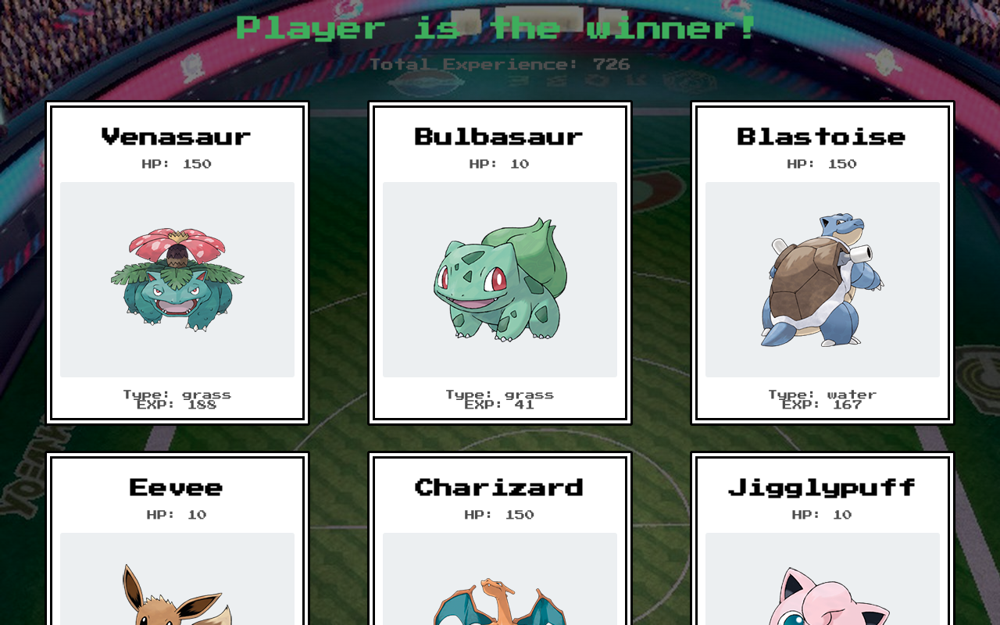

# pokemon-card-game

https://simple-pokemon-card-game.web.app/

A simple Pokemon game React app. 

The app uses a Pokemon API to pull the Pokemon name form a directory along with it's type. The object of the game is whoever has the most exp, wins the battle. The game is completely random at the page reload.

